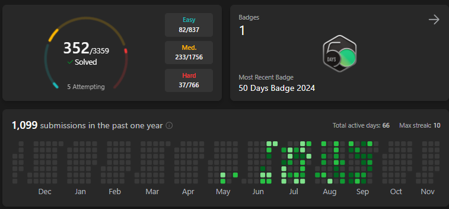

# Description

This repo contains tasks and solutions for LeetCode and NeetCode challenges I can confidently solve in Python and Golang.

# My Progress

[LeetCode Dashboard](https://leetcode.com/u/6iEph3Npnj/)

